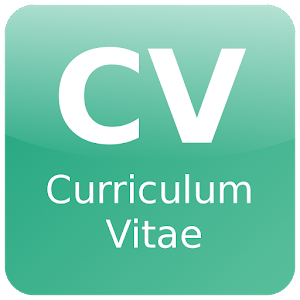
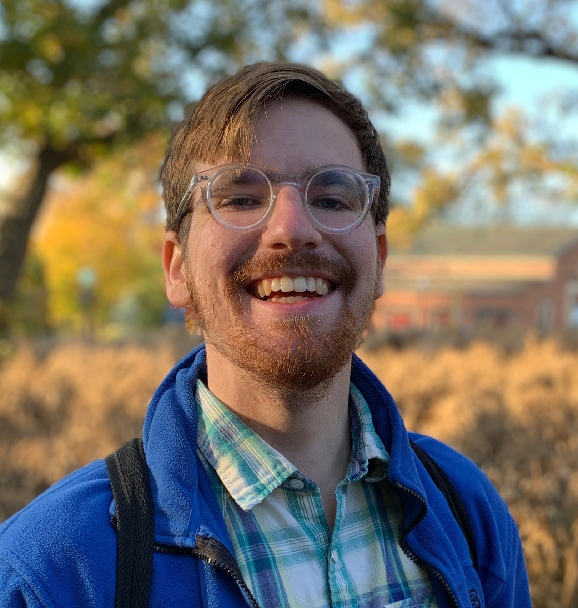

<a href="research.html" style="font-size:22px; font-weight: bold;">Research</a>&nbsp;&nbsp;&nbsp;&nbsp;&nbsp;&nbsp;&nbsp;&nbsp;&nbsp;&nbsp;<a href="publications.html" style="font-size:22px; font-weight: bold;">Publications</a>&nbsp;&nbsp;&nbsp;&nbsp;&nbsp;&nbsp;&nbsp;&nbsp;&nbsp;&nbsp;<a href="talks.html" style="font-size:22px; font-weight: bold;">Talks</a>&nbsp;&nbsp;&nbsp;&nbsp;&nbsp;&nbsp;&nbsp;&nbsp;&nbsp;&nbsp;<a href="personal.html" style="font-size:22px; font-weight: bold;">Personal</a>&nbsp;&nbsp;&nbsp;&nbsp;&nbsp;&nbsp;&nbsp;&nbsp;&nbsp;&nbsp;    

  

  
Patrick D. Aleo

  
AI/ML Researcher for Time-Domain Science in Astronomy

**NOTE:** This page is under development. Come back later for more!

Hello! My name is Patrick. I work to advance our understanding of the universe by identifying and characterizing astronomical events, particularly the violent explosive deaths of stars called supernovae. My research interests include time-series analysis, anomaly detection, deep learning, data mining, and data visualization. I'm currently looking to transition into industry from academia with the completion of my Astronomy Ph.D. at the University of Illinois at Urbana-Champaign (expected late 2023).

As a Ph.D. Candidate at UIUC, I'm at 2x [Center for AstroPhysical Surveys (CAPS) Scholar](https://caps.ncsa.illinois.edu/overview/) at the National Center for Supercomputing Applications (NCSA). I work with Assistant Prof. [Gautham Narayan](https://gnarayan.github.io) on developing machine learning models for photometric classification of supernovae, rare supernovae detection, and visualizing the reduced-dimensional latent spaces of natively high-dimensional data. I am an active member of the [Young Supernova Experiment (YSE)](https://yse.ucsc.edu), where I lead the [first data release](https://arxiv.org/pdf/2211.07128.pdf), and the [SuperNova Anomaly Detection (SNAD)](https://snad.space) team---an international network of researchers from Sternberg astronomical institute, Laboratoire de Physique de Clermont, Space Research Institute, Moscow Institute of Physics and Technology, and University of Illinois Urbana-Champaign, joined together to solve the problem of detecting unusual objects in astronomical databases with machine learning methods---among others. In my first years at UIUC as a [Fiddler Innovation Scholar](https://edream.illinois.edu/endowment/fiddler-innovation-fellowship), I worked with the brilliant Prof. [Donna Cox](https://en.wikipedia.org/wiki/Donna_Cox) and the [Advanced Visualization Lab](https://avl.ncsa.illinois.edu) at NCSA to intergrate unsupervised clustering algorithms into pipelines for cinematic astrophysical data visualization for museum shows and scientific documentaries. As an undergraduate at the University of Texas at Austin, I measured chemical abundances of elements in twin-stars.

Aside from research, I'm a cinephile (lover of movies) and an oenophile (lover of wine). I did a spurt of film background work in Austin and as a result have my own acting page on [IMDb](https://www.imdb.com/name/nm9893142/?ref_=nv_sr_srsg_3). I can also make a mean 6 cheese and pear ravioli (family recipe, sorry I can't share).

Feel free to peruse the website!

Education

  
The University of Illinois at Urbana-Champaign, Ph.D. Astronomy (Aug. 2018 - late 2023, expected)

  
The University of Texas at Austin, BS Physics (Aug. 2014 - Dec. 2017)

  
The University of Texas at Austin, BS Astronomy (Aug. 2014 - Dec. 2017)

